# Web Security Vulnerabilities Demonstration Report

**Author:** Wenura  
**Date:** November 22, 2025  
**Project:** Security Demo - Web Vulnerabilities & Mitigation

---

## Table of Contents

1. [Introduction](#1-introduction)
2. [SQL Injection](#2-sql-injection)
3. [Stored XSS](#3-stored-xss-cross-site-scripting)
4. [Reflected XSS](#4-reflected-xss)
5. [DOM-based XSS](#5-dom-based-xss)
6. [CSRF (Cross-Site Request Forgery)](#6-csrf-cross-site-request-forgery)
7. [Conclusion](#7-conclusion)
8. [References](#8-references)

---

## 1. Introduction

### 1.1 Purpose
This report demonstrates common web security vulnerabilities found in web applications and their proper mitigation techniques. Each vulnerability is presented with:
- Vulnerable implementation
- Exploitation demonstration
- Secure implementation
- Best practices

### 1.2 Testing Environment
- **Server:** Apache (XAMPP)
- **Database:** MySQL/MariaDB
- **Language:** PHP 7.4+
- **URL:** http://localhost/security-demo

### 1.3 Overview
This project demonstrates the OWASP Top 10 vulnerabilities:
- SQL Injection
- Cross-Site Scripting (Stored, Reflected, DOM-based)
- Cross-Site Request Forgery (CSRF)

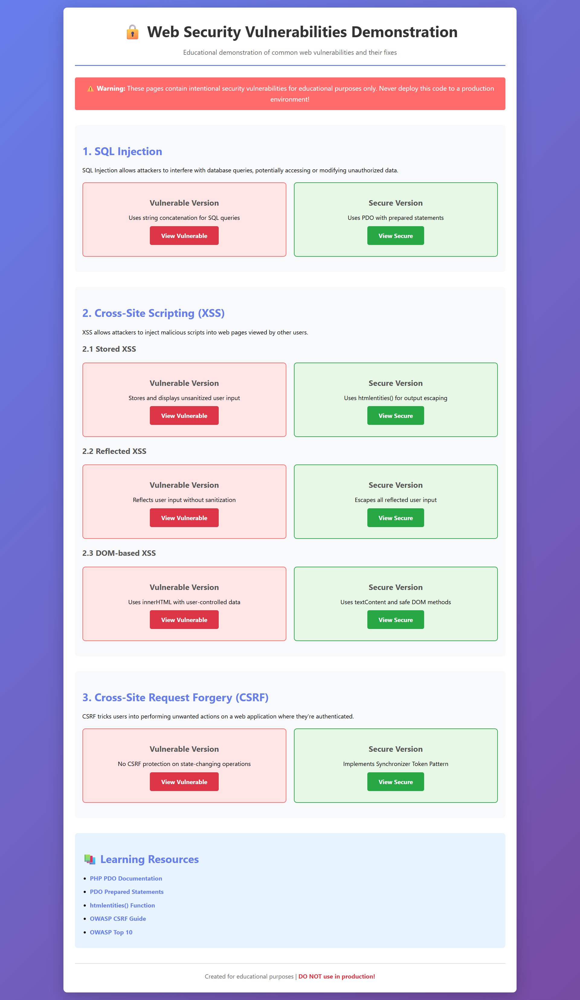
*Figure 1: Security Demo Home Page*

---

## 2. SQL Injection

### 2.1 Introduction

**What is SQL Injection?**  
SQL Injection is a code injection technique where attackers insert malicious SQL statements into input fields to manipulate database queries. It's one of the most critical web application vulnerabilities.

**Why it's dangerous:**
- Complete database access
- Authentication bypass
- Data theft and modification
- Potential server compromise

**Real-world impact:**
- **2017 Equifax Breach:** 147 million records stolen
- **2019 Capital One:** 100 million customer records exposed
- Average cost: $3.86 million per breach

### 2.2 Vulnerable Code Analysis

**Location:** `vulnerable/sql_injection.php`

```php
// VULNERABLE CODE
$username = $conn->real_escape_string($_POST['username']);
$password = $conn->real_escape_string($_POST['password']);

$query = "SELECT * FROM users WHERE username = '$username' AND password = '$password'";
$result = $conn->query($query);
```

**Why it's vulnerable:**
- String concatenation in SQL query
- User input becomes part of SQL structure
- `real_escape_string()` prevents syntax errors but NOT SQL injection
- Attacker can manipulate query logic

**The Problem:**
Even with escaping, the query structure can be altered:
```sql
-- Original intended query:
SELECT * FROM users WHERE username = 'admin' AND password = 'secret'

-- Malicious input: admin' OR '1'='1
SELECT * FROM users WHERE username = 'admin' OR '1'='1' AND password = 'anything'
-- The OR '1'='1' makes the condition always true
```

### 2.3 Exploitation Demonstration

**Attack Payload:**
- Username: `admin' OR '1'='1`
- Password: `anything`

**Step-by-step:**
1. Navigate to `http://localhost/security-demo/vulnerable/sql_injection.php`
2. Enter malicious username
3. Enter any password
4. Click "Login"

**Result:**


*Figure 2: Successful SQL Injection Attack - Unauthorized Access*

**What happened:**
1. SQL query became: `SELECT * FROM users WHERE username = 'admin' OR '1'='1' AND password = 'anything'`
2. The `'1'='1'` is always TRUE
3. Authentication bypassed completely
4. System returns first user (admin) from database
5. Attacker gains unauthorized access

### 2.4 Impact Assessment

**Data that could be compromised:**
- All user credentials
- Personal information (emails, names, addresses)
- Financial data
- Admin accounts

**Actions attacker could perform:**
- View all database records
- Modify/delete data
- Create new admin accounts
- Extract sensitive information
- Drop entire tables

**Severity Rating:** ⚠️ **CRITICAL**

**CVSS Score:** 9.8/10
- Easy to exploit
- No authentication required
- Complete database compromise possible

### 2.5 Secure Code Implementation

**Location:** `secure/sql_injection_fixed.php`

```php
// SECURE CODE - Using PDO Prepared Statements
$pdo = getSecureConnection();

$stmt = $pdo->prepare("SELECT * FROM users WHERE username = :username AND password = :password");
$stmt->execute([
    ':username' => $username,
    ':password' => $password
]);

$user = $stmt->fetch();
```

**Security measures:**
1. **PDO (PHP Data Objects):** Modern database abstraction layer
2. **Prepared Statements:** SQL structure separated from data
3. **Parameter Binding:** Values treated as data only, never as SQL code
4. **Type Safety:** Database driver handles escaping automatically

**Key differences:**

| Vulnerable | Secure |
|------------|--------|
| String concatenation | Prepared statements |
| User input in SQL structure | Parameters bound separately |
| MySQL extension | PDO abstraction |
| Manual escaping | Automatic handling |

### 2.6 Testing the Fix

**Test the same attack:**
- Username: `admin' OR '1'='1`
- Password: `anything`

**Result:**

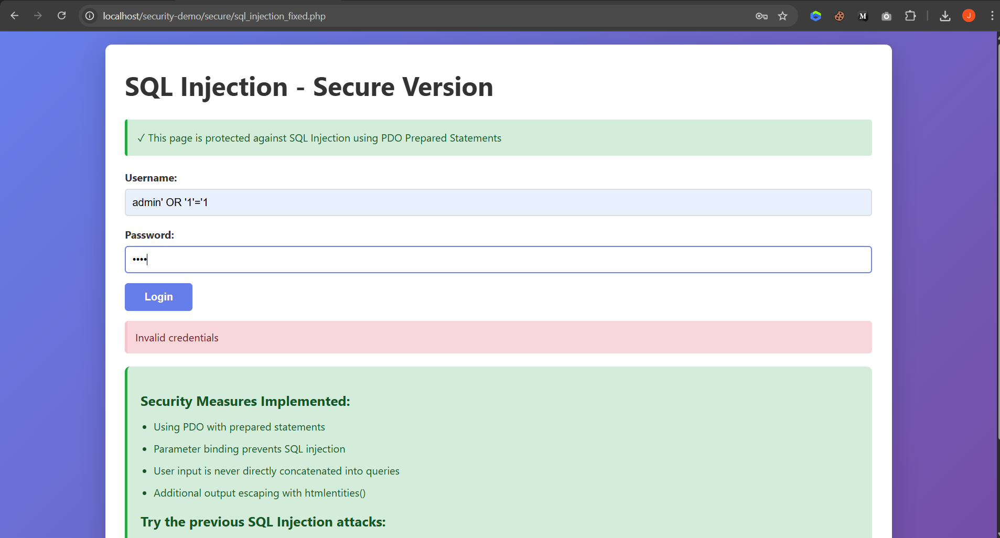
*Figure 3: SQL Injection Attack Blocked - Secure Version*

**Why the attack fails:**
1. Prepared statement treats entire input as literal string
2. Database looks for user with username exactly: `admin' OR '1'='1`
3. No such user exists
4. Authentication fails properly
5. SQL structure cannot be modified

**Explanation:**
```sql
-- With prepared statements:
-- The query structure is sent first:
PREPARE stmt FROM 'SELECT * FROM users WHERE username = ? AND password = ?'

-- Then values are sent separately:
EXECUTE stmt USING 'admin\' OR \'1\'=\'1', 'anything'

-- Database treats the entire string as data, not SQL code
```

### 2.7 Best Practices

✅ **Always use prepared statements** for database queries  
✅ **Never concatenate** user input into SQL  
✅ **Use PDO or MySQLi** with parameter binding  
✅ **Implement least privilege** - database user should have minimal permissions  
✅ **Input validation** as defense in depth  
✅ **Use ORM frameworks** (Laravel Eloquent, Doctrine) when possible  
✅ **Regular security audits** and code reviews  
✅ **Web Application Firewall (WAF)** as additional layer

---

## 3. Stored XSS (Cross-Site Scripting)

### 3.1 Introduction

**What is Stored XSS?**  
Stored XSS occurs when malicious scripts are permanently stored on the target server (database, file system) and executed when users view the affected page.

**Why it's dangerous:**
- Persistent attack affecting all users
- Cookie/session theft
- Account hijacking
- Malware distribution
- Phishing attacks

**Real-world impact:**
- **MySpace Samy Worm (2005):** 1 million users infected in 20 hours
- **TweetDeck (2014):** XSS worm spread across Twitter
- **eBay (2014):** Stored XSS affecting millions

### 3.2 Vulnerable Code Analysis

**Location:** `vulnerable/xss_stored.php`

```php
// STORING - Prevents SQL errors but allows XSS
$username = $conn->real_escape_string($_POST['username']);
$comment = $conn->real_escape_string($_POST['comment']);
$query = "INSERT INTO comments (username, comment) VALUES ('$username', '$comment')";
$conn->query($query);

// DISPLAYING - VULNERABLE!
foreach ($comments as $comment) {
    echo $comment['username']; // No escaping
    echo $comment['comment'];  // No escaping
}
```

**Why it's vulnerable:**
- User input stored without sanitization
- Output displayed without HTML encoding
- Browser executes any JavaScript in the content
- `real_escape_string()` only prevents SQL errors, not XSS

### 3.3 Exploitation Demonstration

**Attack Payload #1:**
```html
<script>alert('XSS Attack!')</script>
```

**Attack Payload #2:**
```html

```

**Steps:**
1. Navigate to vulnerable page
2. Username: `Attacker`
3. Comment: `<script>alert('XSS Attack!')</script>`
4. Submit

**Result:**

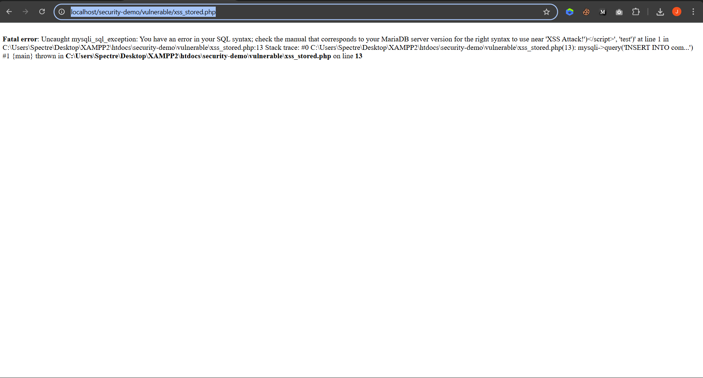
*Figure 4: Entering Malicious Script*

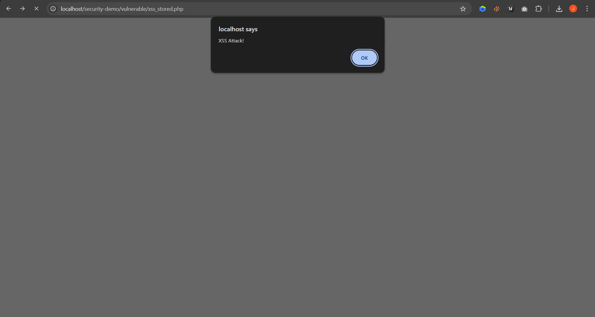
*Figure 5: Script Executes on Page Load*

**What happened:**
1. Malicious script stored in database
2. Page loads comments from database
3. Browser renders the script tag
4. JavaScript executes immediately
5. Alert appears (in real attack: cookie theft, redirection, etc.)
6. **Every user** viewing the page is affected

### 3.4 Impact Assessment

**Data that could be compromised:**
- Session cookies
- Authentication tokens
- Personal information displayed on page
- Form data (CSRF attacks)

**Actions attacker could perform:**
- Steal user sessions
- Perform actions as the victim
- Redirect to phishing sites
- Inject fake login forms
- Keylogging
- Cryptocurrency mining
- Spread XSS worms

**Severity Rating:** ⚠️ **HIGH**

**CVSS Score:** 7.1/10

### 3.5 Secure Code Implementation

**Location:** `secure/xss_stored_fixed.php`

```php
// STORING - Using prepared statements
$stmt = $pdo->prepare("INSERT INTO comments (username, comment) VALUES (:username, :comment)");
$stmt->execute([
    ':username' => $username,
    ':comment' => $comment
]);

// DISPLAYING - SECURE!
foreach ($comments as $comment) {
    echo htmlentities($comment['username'], ENT_QUOTES, 'UTF-8');
    echo htmlentities($comment['comment'], ENT_QUOTES, 'UTF-8');
}
```

**Security measures:**
1. **htmlentities():** Converts special characters to HTML entities
2. **ENT_QUOTES:** Escapes both single (') and double (") quotes
3. **UTF-8 encoding:** Prevents encoding-based attacks

**Character conversion:**
- `<` → `&lt;`
- `>` → `&gt;`
- `"` → `&quot;`
- `'` → `&#039;`
- `&` → `&amp;`

### 3.6 Testing the Fix

**Test same attack:**
Comment: `<script>alert('XSS Attack!')</script>`

**Result:**

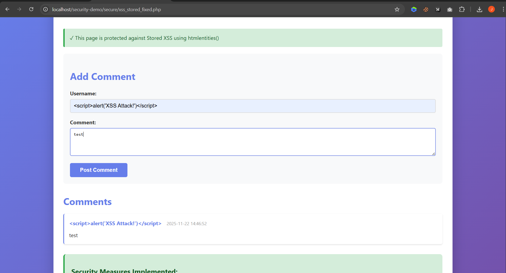
*Figure 6: XSS Attack Blocked - Displayed as Text*

**Why attack fails:**
- Script converted to: `&lt;script&gt;alert('XSS Attack!')&lt;/script&gt;`
- Browser displays it as plain text
- No JavaScript execution
- Safe to view for all users

### 3.7 Best Practices

✅ **Escape all output** with `htmlentities()` or `htmlspecialchars()`  
✅ **Use ENT_QUOTES** flag always  
✅ **Specify UTF-8** encoding  
✅ **Content Security Policy (CSP)** headers  
✅ **HTTPOnly cookies** to prevent JavaScript access  
✅ **Input validation** (whitelist acceptable characters)  
✅ **Context-aware encoding** (HTML, JavaScript, URL, CSS)

---

## 4. Reflected XSS

### 4.1 Introduction

**What is Reflected XSS?**  
Reflected XSS occurs when malicious scripts are reflected off a web server in the response, typically from URL parameters or form inputs.

**Why it's dangerous:**
- Immediate execution
- Spread via malicious links
- Phishing campaigns
- Session hijacking

**Real-world examples:**
- Targeted phishing attacks
- Social engineering campaigns
- Credential theft

### 4.2 Vulnerable Code Analysis

**Location:** `vulnerable/xss_reflected.php`

```php
// VULNERABLE CODE
$search = isset($_GET['search']) ? $_GET['search'] : '';

// Reflecting without escaping
echo "Search results for: " . $search;
echo "No results found for \"" . $search . "\"";
```

**Why it's vulnerable:**
- Direct output of GET parameter
- No HTML encoding
- User input reflected immediately

### 4.3 Exploitation Demonstration

**Attack URL:**
```
http://localhost/security-demo/vulnerable/xss_reflected.php?search=<script>alert('XSS')</script>
```

**Or via form:**
Search input: ``

**Result:**


*Figure 7: Reflected XSS Attack Successful*

**What happened:**
1. Malicious script in URL parameter
2. Server reflects it in response
3. Browser executes JavaScript
4. Attack occurs immediately

### 4.4 Impact Assessment

**Severity:** ⚠️ **MEDIUM to HIGH**

**Attack vectors:**
- Phishing emails with malicious links
- Social media posts
- Compromised advertisements

### 4.5 Secure Implementation

**Location:** `secure/xss_reflected_fixed.php`

```php
// SECURE CODE
$search = isset($_GET['search']) ? $_GET['search'] : '';

echo "Search results for: " . htmlentities($search, ENT_QUOTES, 'UTF-8');
echo "No results found for \"" . htmlentities($search, ENT_QUOTES, 'UTF-8') . "\"";
```

### 4.6 Testing the Fix

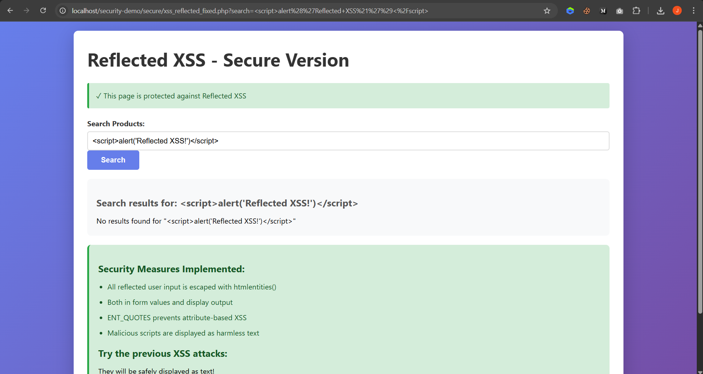
*Figure 8: Reflected XSS Blocked*

**Result:** Script displayed as harmless text

### 4.7 Best Practices

✅ **Escape all reflected input**  
✅ **Validate input format**  
✅ **Use CSP headers**  
✅ **Implement HTTPS**

---

## 5. DOM-based XSS

### 5.1 Introduction

**What is DOM-based XSS?**  
DOM-based XSS occurs entirely in the browser when JavaScript reads from unsafe sources and writes to dangerous sinks without proper sanitization.

**Why it's dangerous:**
- Client-side vulnerability
- Bypasses server-side filters
- Difficult to detect with traditional scanners

### 5.2 Vulnerable Code Analysis

**Location:** `vulnerable/xss_dom.php`

```javascript
// VULNERABLE JavaScript
function greetUser() {
    var name = document.getElementById('nameInput').value;
    greeting.innerHTML = '<h2>Hello, ' + name + '!</h2>';
}

window.onload = function() {
    var hash = decodeURIComponent(window.location.hash.substring(1));
    document.getElementById('greeting').innerHTML = hash;
};
```

**Unsafe sources:**
- `window.location.hash`
- `window.location.search`
- `document.referrer`

**Dangerous sinks:**
- `innerHTML`
- `document.write()`
- `eval()`

### 5.3 Exploitation Demonstration

**Attack:**
Input: ``

**Result:**

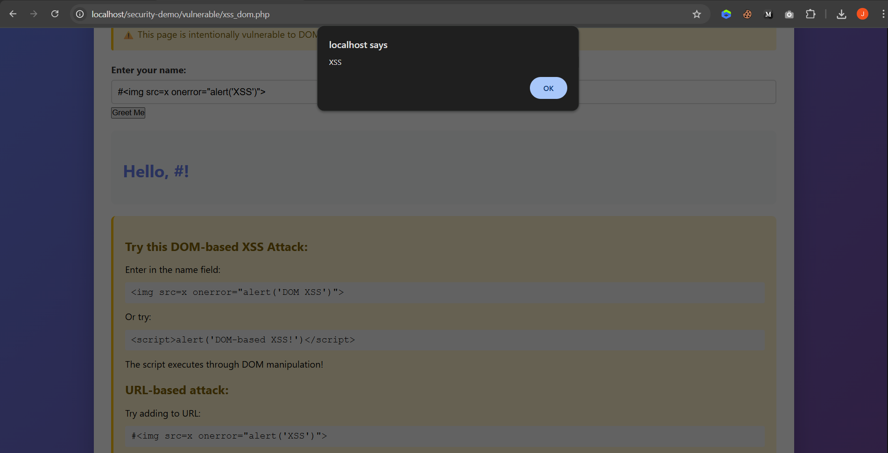
*Figure 9: DOM-based XSS Attack*

### 5.4 Secure Implementation

**Location:** `secure/xss_dom_fixed.php`

```javascript
// SECURE JavaScript
function greetUser() {
    var name = document.getElementById('nameInput').value;
    
    var h2 = document.createElement('h2');
    h2.textContent = 'Hello, ' + name + '!';
    
    greeting.innerHTML = '';
    greeting.appendChild(h2);
}
```

### 5.5 Testing the Fix

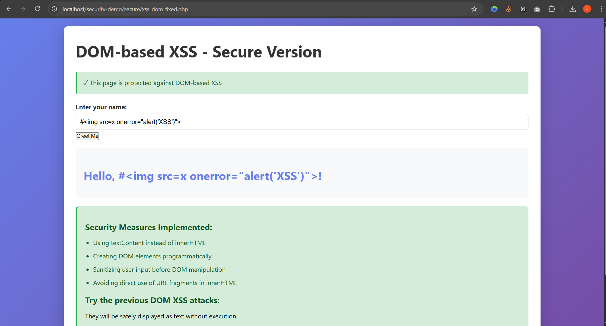
*Figure 10: DOM XSS Blocked*

**Why it works:**
- `textContent` treats input as plain text
- `createElement()` creates safe DOM nodes
- No HTML parsing occurs

### 5.6 Best Practices

✅ **Use textContent instead of innerHTML**  
✅ **Sanitize URL parameters**  
✅ **Avoid eval() and document.write()**  
✅ **Use DOMPurify library** for sanitization

---

## 6. CSRF (Cross-Site Request Forgery)

### 6.1 Introduction

**What is CSRF?**  
CSRF tricks authenticated users into performing unwanted actions by exploiting their active session.

**Why it's dangerous:**
- Unauthorized state changes
- Financial transactions
- Account modifications
- Data deletion

**Real-world impact:**
- **Gmail (2007):** CSRF used to create email filters
- **Netflix (2006):** Account modifications
- **ING Direct (2008):** Unauthorized transfers

### 6.2 Vulnerable Code Analysis

**Location:** `vulnerable/csrf.php`

```php
// VULNERABLE - No token validation
if ($_SERVER['REQUEST_METHOD'] === 'POST') {
    $product_id = intval($_POST['product_id']);
    $quantity = intval($_POST['quantity']);
    // Process order without verification
}
```

```html
<!-- No CSRF token -->
<form method="POST">
    <input type="hidden" name="product_id" value="1">
    <button type="submit">Order Now</button>
</form>
```

### 6.3 Exploitation Demonstration

**Attacker creates malicious page:**
```html
<form action="http://localhost/security-demo/vulnerable/csrf.php" method="POST">
    <input type="hidden" name="product_id" value="1">
    <input type="hidden" name="quantity" value="100">
</form>
<script>document.forms[0].submit();</script>
```

**Attack flow:**
1. Victim logged into application
2. Visits attacker's page
3. Form auto-submits
4. Browser sends cookies automatically
5. Unauthorized order placed

**Results:**

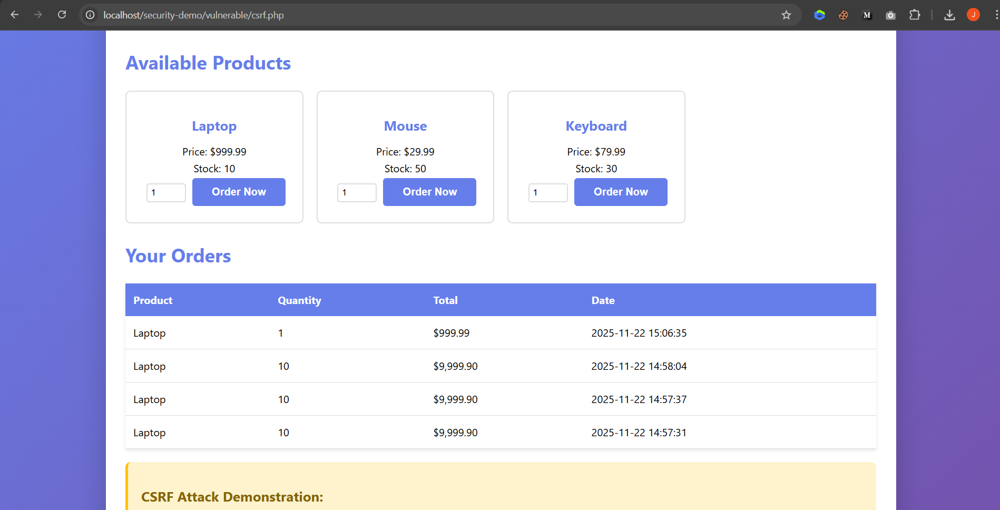
*Figure 11: CSRF Vulnerable Page*

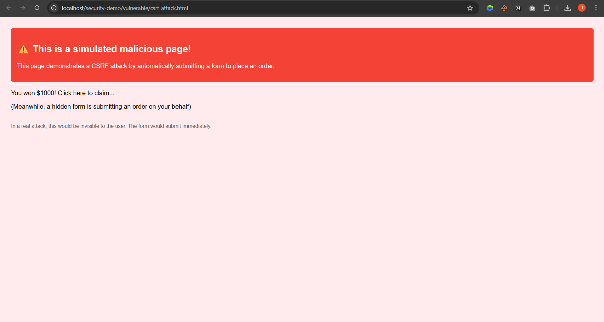
*Figure 12: Malicious CSRF Attack Page*

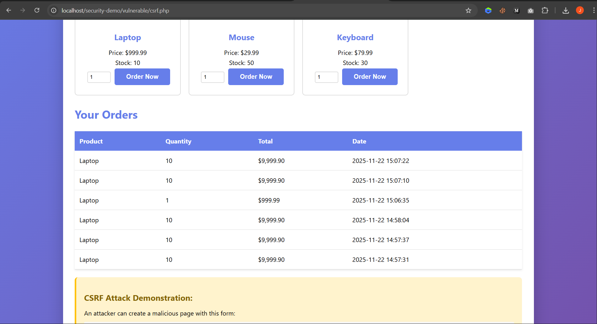
*Figure 13: Unauthorized Order Placed*

### 6.4 Impact Assessment

**Severity:** ⚠️ **HIGH**

**Potential damage:**
- Unauthorized purchases
- Password changes
- Email changes
- Data deletion
- Admin privilege escalation

### 6.5 Secure Implementation

**Location:** `secure/csrf_fixed.php` and `includes/csrf_token.php`

```php
// Token generation
function generateCsrfToken() {
    if (!isset($_SESSION['csrf_token'])) {
        $_SESSION['csrf_token'] = bin2hex(random_bytes(32));
    }
    return $_SESSION['csrf_token'];
}

// Token validation
function validateCsrfToken($token) {
    if (!isset($_SESSION['csrf_token'])) {
        return false;
    }
    return hash_equals($_SESSION['csrf_token'], $token);
}

// In form processing
if (!validateCsrfToken($_POST['csrf_token'])) {
    die("CSRF attack detected!");
}
```

```html
<!-- Secure form with token -->
<form method="POST">
    <input type="hidden" name="csrf_token" value="<?php echo generateCsrfToken(); ?>">
    <button type="submit">Order Now</button>
</form>
```

### 6.6 Testing the Fix

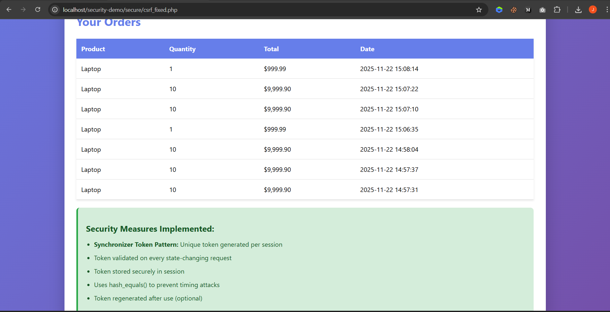
*Figure 14: CSRF Attack Blocked*

**Why attack fails:**
- Attacker cannot obtain token
- Token unique per session
- Validation fails without correct token
- Request rejected

### 6.7 Best Practices

✅ **Implement CSRF tokens** for all state-changing operations  
✅ **Use hash_equals()** to prevent timing attacks  
✅ **SameSite cookie attribute**  
✅ **Verify Origin/Referer headers** (additional layer)  
✅ **Re-authenticate** for critical actions

---

## 7. Conclusion

### 7.1 Summary

This project demonstrated five critical web vulnerabilities:

| Vulnerability | Severity | Mitigation |
|--------------|----------|------------|
| SQL Injection | Critical | Prepared statements |
| Stored XSS | High | Output escaping |
| Reflected XSS | Medium-High | Output escaping |
| DOM-based XSS | Medium-High | Safe DOM manipulation |
| CSRF | High | Token validation |

### 7.2 Key Takeaways

1. **Never trust user input** - Validate and sanitize everything
2. **Defense in depth** - Multiple security layers
3. **Secure by default** - Use frameworks with built-in protection
4. **Regular updates** - Keep software patched
5. **Security awareness** - Educate developers

### 7.3 Next Steps

- Implement WAF (Web Application Firewall)
- Add Content Security Policy
- Enable HTTPS
- Conduct regular security audits
- Use automated scanning tools

---

## 8. References

### Documentation
- [OWASP Top 10](https://owasp.org/www-project-top-ten/)
- [PHP Security Guide](https://www.php.net/manual/security.php)
- [PDO Documentation](https://www.php.net/manual/book.pdo.php)

### Security Resources
- [OWASP XSS Prevention](https://cheatsheetseries.owasp.org/cheatsheets/Cross_Site_Scripting_Prevention_Cheat_Sheet.html)
- [OWASP SQL Injection Prevention](https://cheatsheetseries.owasp.org/cheatsheets/SQL_Injection_Prevention_Cheat_Sheet.html)
- [OWASP CSRF Prevention](https://cheatsheetseries.owasp.org/cheatsheets/Cross-Site_Request_Forgery_Prevention_Cheat_Sheet.html)

### Learning Platforms
- [PortSwigger Web Security Academy](https://portswigger.net/web-security)
- [OWASP WebGoat](https://owasp.org/www-project-webgoat/)

---

**End of Report**

*This document is for educational purposes only. Never deploy vulnerable code to production environments.*
